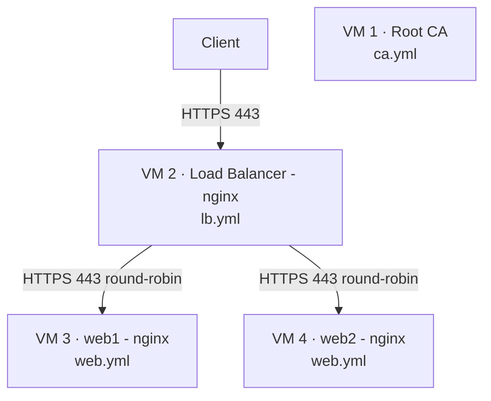
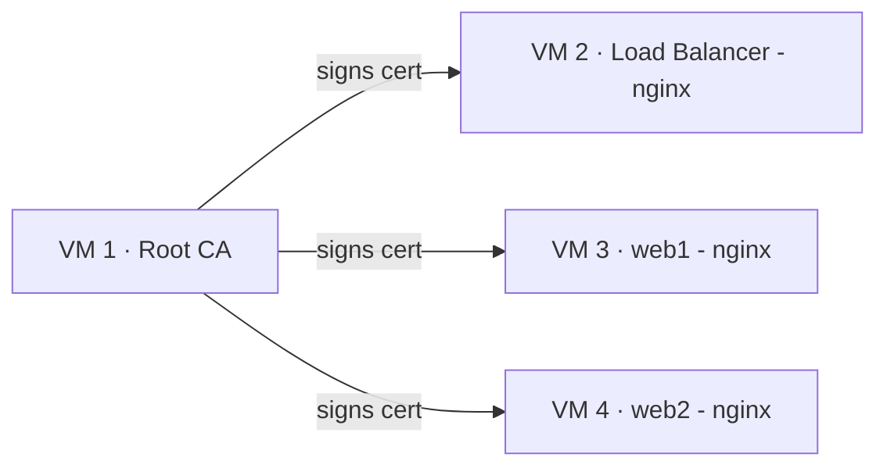
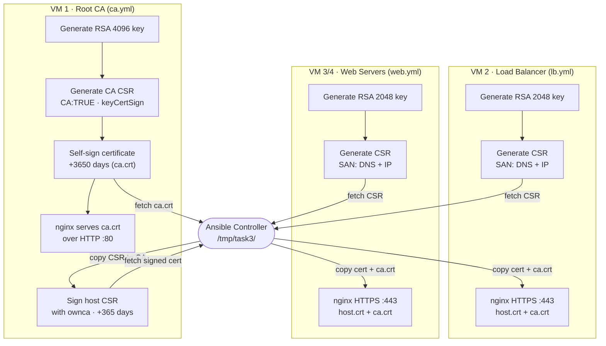
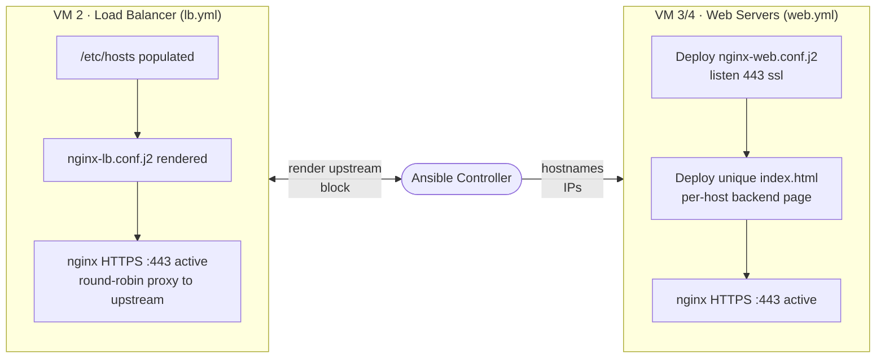
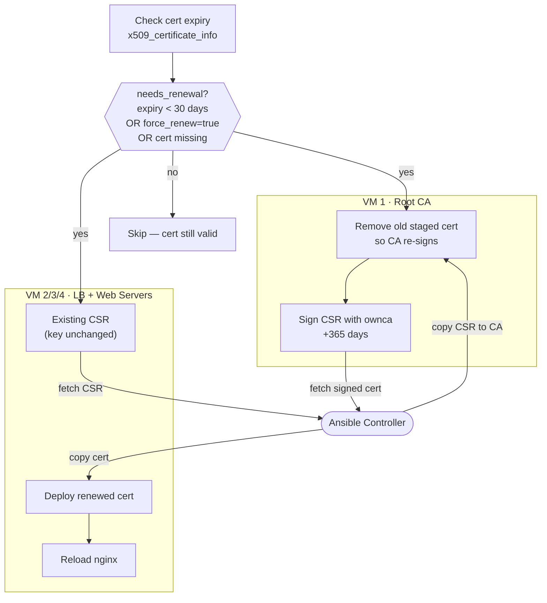

# Task3: PKI + HTTPS Load Balancer

Demonstrates a full PKI trust chain using Terraform and Ansible on Nutanix:
a Root CA signs certificates for all VMs, an nginx load balancer terminates HTTPS
from clients and proxies traffic to HTTPS-only web backends.

## Architecture

### LB


### PKI


| VM | Role | Ansible Group |
|----|------|---------------|
| `*-ca` | Root CA — signs all CSRs | `task3_ca` |
| `*-lb` | nginx load balancer — HTTPS round-robin | `task3_lb` |
| `*-web1`, `*-web2`, … | nginx web servers — unique HTTPS pages | `task3_web` |

## Ansible playbooks workflow
### PKI


### Web server configuration


### Certificate renewal (renew.yml)


## Scaling the web tier

To add more web servers, edit `infra.auto.tfvars`:

```hcl
web_server_names = ["web1", "web2", "web3"]
```

Then re-provision and reconfigure:

```bash
terraform apply
ansible-playbook site.yml
```

The new VM is automatically included in the LB upstream block and receives its own CA-signed certificate.

## How to run

### 1. Provision VMs with Terraform

```bash
cd implementation/task3/terraform
tofu init
tofu apply
```

### 2. Install Ansible collections

```bash
cd implementation/task3/ansible
ansible-galaxy collection install -r requirements.yml
```

### 3. Verify connectivity

```bash
ansible -m ping all
```

### 4. Deploy the full stack

```bash
ansible-playbook playbooks/site.yml
```

All playbooks are fully idempotent — re-running them is safe. `community.crypto` modules only regenerate keys and certificates if they don't already exist or have changed.

Or run individual playbooks:

```bash
ansible-playbook playbooks/ca.yml     # Set up Root CA
ansible-playbook playbooks/web.yml    # Configure web servers (requires CA to be ready)
ansible-playbook playbooks/lb.yml     # Configure load balancer (requires CA to be ready)
ansible-playbook playbooks/renew.yml  # Renew certs expiring within 30 days
```

## Verification

```bash
# Download the CA certificate from the CA VM (served over HTTP by nginx)
curl http://<CA_IP>/ca.crt -o ca.crt

# Hit the LB with full certificate validation
curl --cacert ca.crt https://<LB_IP>/

# Verify a web server's certificate against the CA
openssl verify -CAfile ca.crt /tmp/task3/<web-vm-hostname>.crt
```

To trust the CA in your browser or OS, import `ca.crt` into your trust store:

```bash
# Linux (system-wide)
sudo cp ca.crt /usr/local/share/ca-certificates/task3-ca.crt
sudo update-ca-certificates
```

## Certificate flow

```
CA VM                     Controller             Web / LB VM
 │                            │                      │
 │                            │  Generate key+CSR    │
 │                            │◄─────────────────────│
 │  Copy CSR to CA            │                      │
 │◄───────────────────────────│                      │
 │  Sign CSR (ownca)          │                      │
 │─────────────────────────►  │                      │
 │  Fetch signed cert         │                      │
 │──────────────────────────► │                      │
 │                            │  Deploy cert + CA cert│
 │                            │──────────────────────►│
```

The CA private key (`/etc/pki/ca/ca.key`) never leaves VM 1.
